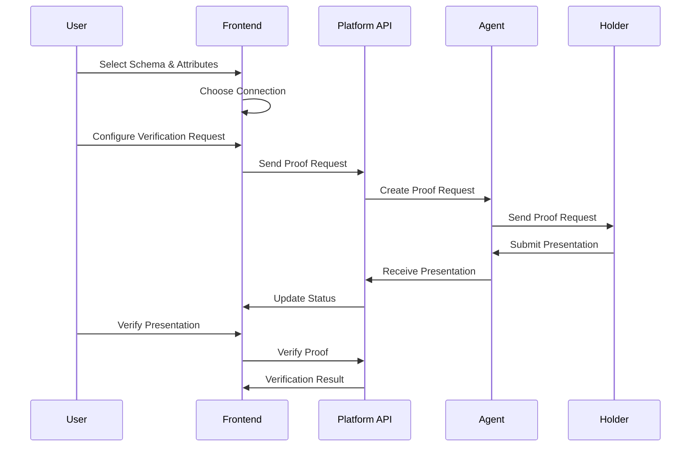
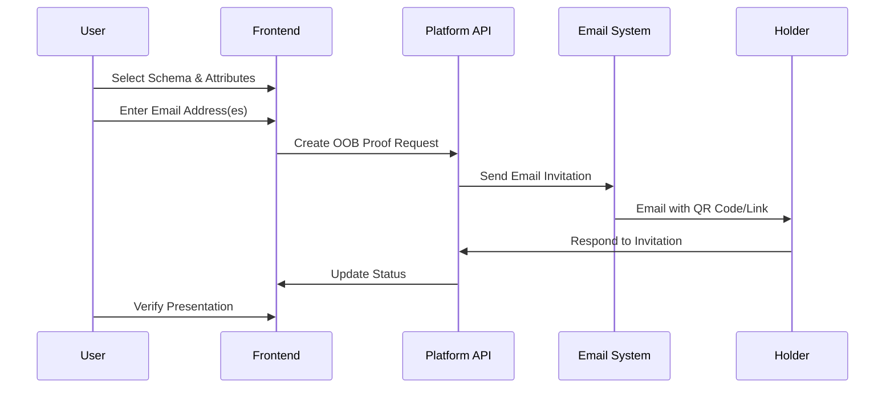

# Verification Process (Proof Request) Developer Guide

## Table of Contents
- [Overview](#overview)
- [Architecture](#architecture)
- [Verification Flow](#verification-flow)
- [API Endpoints](#api-endpoints)
- [TypeScript Interfaces](#typescript-interfaces)
- [Implementation Examples](#implementation-examples)
- [UI Components](#ui-components)
- [Navigation Flow](#navigation-flow)
- [Error Handling](#error-handling)
- [Best Practices](#best-practices)
- [Troubleshooting](#troubleshooting)

## Overview

The verification process (proof request) in CREDEBL allows organizations to request and verify credentials from connected entities. The system supports both INDY-based credentials and W3C verifiable credentials, providing flexible verification capabilities for different credential types.

### Key Features
- **Dual Protocol Support**: INDY and W3C credential verification
- **Connection-based Verification**: Direct verification via established connections
- **Email-based Out-of-Band (OOB) Verification**: Verification via email invitations
- **Attribute Selection**: Granular control over which attributes to verify
- **Predicate Support**: Support for range proofs and conditional verification
- **Real-time Status Tracking**: Monitor verification request states

## Architecture

```
┌─────────────────┐    ┌──────────────────┐    ┌─────────────────┐
│   Terminal      │    │   Platform API   │    │   Agent/Wallet  │
│   (React/TS)    │◄──►│   (Backend)      │◄──►│   (ACA-Py/etc)  │
└─────────────────┘    └──────────────────┘    └─────────────────┘
         │                       │                       │
         │                       │                       │
    ┌────▼────┐            ┌─────▼─────┐         ┌──────▼──────┐
    │ UI Flow │            │ API Layer │         │ Verification│
    │ Control │            │ Routing   │         │ Protocol    │
    └─────────┘            └───────────┘         └─────────────┘
```

## Verification Flow

### 1. Connection-Based Verification Flow



### 2. Email-Based (OOB) Verification Flow



## API Endpoints

### Base Configuration
```typescript
// From apiRoutes.ts
const Verification = {
  getAllRequestList: "/credentials/proofs",
  verifyCredential: "/proofs",
  oobProofRequest: "/proofs/oob",
  presentationVerification: "/proofs",
  proofRequestAttributesVerification: "/verified-proofs",
  verificationCredDef: "/verifiation/cred-defs",
};
```

### 1. Create Proof Request (Connection-based)

**Endpoint**: `POST /organizations/{orgId}/proofs?requestType={INDY|presentationExchange}`

**Request Types**:
- `INDY`: For INDY-based credentials
- `presentationExchange`: For W3C credentials

#### INDY Request Payload
```typescript
{
  connectionId: string;
  comment: string;
  orgId: string;
  proofFormats: {
    indy: {
      attributes: Array<{
        attributeName: string;
        condition?: string;
        value?: number;
        credDefId?: string;
        schemaId: string;
      }>;
    };
  };
}
```

#### W3C Request Payload
```typescript
{
  connectionId: string;
  comment: string;
  presentationDefinition: {
    id: string;
    input_descriptors: Array<{
      id: string;
      name: string;
      schema: Array<{
        uri: string;
      }>;
      constraints: {
        fields: Array<{
          path: string[];
        }>;
      };
      purpose: string;
    }>;
  };
}
```

### 2. Create Out-of-Band Proof Request

**Endpoint**: `POST /organizations/{orgId}/proofs/oob?requestType={INDY|presentationExchange}`

#### INDY OOB Request Payload
```typescript
{
  goalCode: "verification";
  reuseConnection: boolean;
  protocolVersion: "v1" | "v2";
  isShortenUrl: boolean;
  autoAcceptProof: "always" | "contentApproved" | "never";
  emailId: string[];
  proofFormats: {
    indy: {
      name: string;
      version: string;
      requested_attributes: Record<string, {
        name: string;
        restrictions: Array<{
          schema_id: string;
          cred_def_id: string;
        }>;
      }>;
      requested_predicates: Record<string, {
        name: string;
        p_type: string;
        p_value: number;
        restrictions: Array<{
          schema_id: string;
          cred_def_id: string;
        }>;
      }>;
    };
  };
}
```

#### W3C OOB Request Payload
```typescript
{
  goalCode: "verification";
  willConfirm: boolean;
  protocolVersion: "v2";
  presentationDefinition: {
    id: string;
    input_descriptors: Array<{
      id: string;
      name: string;
      schema: Array<{
        uri: string;
      }>;
      constraints: {
        fields: Array<{
          path: string[];
        }>;
      };
      purpose: string;
    }>;
  };
  comment: string;
  autoAcceptProof: "never";
  emailId: string[];
  reuseConnection: boolean;
}
```

### 3. Get Verification List

**Endpoint**: `GET /organizations/{orgId}/proofs?pageSize={size}&pageNumber={page}&search={query}&sortBy={order}&sortField={field}`

**Response**:
```typescript
{
  statusCode: number;
  message: string;
  data: {
    totalItems: number;
    nextPage: number;
    lastPage: number;
    data: RequestProof[];
  };
}
```

### 4. Verify Presentation

**Endpoint**: `POST /organizations/{orgId}/proofs/{proofId}/verify`

**Response**:
```typescript
{
  statusCode: number;
  message: string;
  data: VerificationResult;
}
```

### 5. Get Verified Proof Details

**Endpoint**: `GET /organizations/{orgId}/verified-proofs/{proofId}`

**Response**:
```typescript
{
  statusCode: number;
  message: string;
  data: ProofDetails;
}
```

## TypeScript Interfaces

### Core Verification Interfaces

```typescript
// Request Proof Interface
interface RequestProof {
  _tags: {
    state: string;
    threadId: string;
    connectionId: string;
  };
  metadata: Record<string, any>;
  id: string;
  presentationId: string;
  createdAt: string;
  protocolVersion: string;
  state: string;
  connectionId: string;
  threadId: string;
  autoAcceptProof: string;
  createDateTime: string;
  isVerified?: boolean;
}

// Schema Details
interface SchemaDetail {
  schemaName: string;
  version: string;
  schemaId: string;
  credDefId: string;
}

// W3C Schema Details
interface IW3cSchemaDetails {
  schemaName: string;
  version: string;
  schemaId: string;
  w3cAttributes?: IAttributesData[];
  issuerDid?: string;
  created?: string;
}

// Attribute Data
interface IAttributesData {
  isRequired: boolean;
  name: string;
  value: string;
  dataType: string;
}

// Selected User/Attribute
interface ISelectedUser {
  name?: string;
  condition?: string;
  dataType: string;
  displayName?: string;
  attributeName: string;
  schemaName?: string;
  schemaId?: string;
  credDefName?: string;
  isChecked: boolean;
  value: number;
  selectedOption?: SelectedOption;
  inputError?: string;
  selectError?: string;
  options?: Array<{
    label: string;
    value: string;
  }>;
}

// Condition Options
type SelectedOption = 
  | "Select" 
  | "Greater than" 
  | "Less than" 
  | "Greater than or equal to" 
  | "Less than or equal to";

// Email Verification
interface IEmailValues {
  emailData: Array<{
    email: string;
  }>;
}

// Requested Attributes
interface IRequestedAttributes {
  name: string;
  restrictions: Array<{
    schema_id: string;
    cred_def_id: string;
  }>;
}

// Predicates
interface IPredicate extends IRequestedAttributes {
  p_type: string;
  p_value: number;
}
```

### Enums

```typescript
// Proof Request States
enum ProofRequestState {
  presentationReceived = "presentation-received",
  offerReceived = "offer-received",
  declined = "decliend",
  requestSent = "request-sent",
  requestReceived = "request-received",
  credentialIssued = "credential-issued",
  credentialReceived = "credential-received",
  done = "done",
  abandoned = "abandoned",
}

// User-friendly State Text
enum ProofRequestStateUserText {
  requestSent = "Requested",
  requestReceived = "Received",
  done = "Verified",
  abandoned = "Declined",
}

// Request Types
enum RequestType {
  INDY = "indy",
  PRESENTATION_EXCHANGE = "presentationExchange",
}

// Protocol Versions
enum ProtocolVersion {
  V1 = "v1",
  V2 = "v2",
}

// Auto Accept Options
enum AutoAccept {
  ALWAYS = "always",
  CONTENT_APPROVED = "contentApproved",
  NEVER = "never",
}

// DID Methods
enum DidMethod {
  INDY = "did:indy",
  KEY = "did:key",
  WEB = "did:web",
  POLYGON = "did:polygon",
}
```

## Implementation Examples

### 1. Verification Service Class

```typescript
// services/VerificationService.ts
import { 
  verifyCredential, 
  verifyCredentialV2, 
  createOobProofRequest,
  getVerificationList,
  verifyPresentation,
  getVerifiedProofDetails 
} from '../api/verification';
import { RequestType, ProofRequestState } from '../common/enums';
import { getFromLocalStorage } from '../api/Auth';
import { storageKeys } from '../config/CommonConstant';

export class VerificationService {
  
  /**
   * Create a connection-based proof request
   */
  static async createProofRequest(
    connectionId: string | string[],
    attributes: any[],
    isW3c: boolean = false
  ) {
    try {
      const orgId = await getFromLocalStorage(storageKeys.ORG_ID);
      const requestType = isW3c ? RequestType.PRESENTATION_EXCHANGE : RequestType.INDY;
      
      let payload: any;
      
      if (!isW3c) {
        // INDY proof request
        payload = {
          connectionId,
          comment: 'Proof request',
          orgId,
          proofFormats: {
            indy: {
              attributes: attributes.map(attr => ({
                attributeName: attr.attributeName,
                condition: attr.condition === 'Select' ? undefined : attr.condition,
                value: attr.value === '' ? undefined : attr.value,
                credDefId: attr.credDefId,
                schemaId: attr.schemaId,
              }))
            }
          }
        };
      } else {
        // W3C proof request
        const attributePaths = attributes.map(
          attr => `$.credentialSubject['${attr.attributeName}']`
        );
        
        payload = {
          connectionId,
          comment: 'Proof request',
          presentationDefinition: {
            id: crypto.randomUUID(),
            input_descriptors: [{
              id: crypto.randomUUID(),
              name: 'Verification Request',
              schema: [{
                uri: attributes[0]?.schemaId
              }],
              constraints: {
                fields: [{
                  path: attributePaths,
                }],
              },
              purpose: 'Verify proof'
            }]
          }
        };
      }
      
      // Use V2 API for multiple connections
      if (Array.isArray(connectionId)) {
        return await verifyCredentialV2(payload, requestType);
      } else {
        return await verifyCredential(payload, requestType);
      }
      
    } catch (error) {
      console.error('Error creating proof request:', error);
      throw error;
    }
  }
  
  /**
   * Create an out-of-band proof request via email
   */
  static async createOobProofRequest(
    emails: string[],
    attributes: any[],
    isW3c: boolean = false
  ) {
    try {
      const requestType = isW3c ? RequestType.PRESENTATION_EXCHANGE : RequestType.INDY;
      
      let payload: any = {
        goalCode: "verification",
        reuseConnection: true,
        autoAcceptProof: "never",
        emailId: emails,
      };
      
      if (!isW3c) {
        // INDY OOB request
        const requestedAttributes: Record<string, any> = {};
        const requestedPredicates: Record<string, any> = {};
        
        // Group attributes by name and schema
        const attributeGroups = attributes.reduce((acc, attr) => {
          const key = `${attr.attributeName}:${attr.schemaId}`;
          if (!acc[key]) {
            acc[key] = [];
          }
          acc[key].push(attr.credDefId);
          return acc;
        }, {} as Record<string, string[]>);
        
        // Build requested attributes
        Object.keys(attributeGroups).forEach(key => {
          const [attributeName, schemaId] = key.split(':');
          requestedAttributes[attributeName] = {
            name: attributeName,
            restrictions: attributeGroups[key].map(credDefId => ({
              schema_id: schemaId,
              cred_def_id: credDefId,
            }))
          };
        });
        
        payload = {
          ...payload,
          protocolVersion: "v1",
          isShortenUrl: true,
          proofFormats: {
            indy: {
              name: "proof-request",
              version: "1.0",
              requested_attributes: requestedAttributes,
              requested_predicates: requestedPredicates,
            },
          },
        };
      } else {
        // W3C OOB request
        const inputDescriptors = attributes.map(attr => ({
          id: crypto.randomUUID(),
          name: attr.schemaName || 'Verification Request',
          schema: [{
            uri: attr.schemaId
          }],
          constraints: {
            fields: [{
              path: [`$.credentialSubject['${attr.attributeName}']`],
            }],
          },
          purpose: 'Verify proof',
        }));
        
        payload = {
          ...payload,
          willConfirm: true,
          protocolVersion: "v2",
          presentationDefinition: {
            id: crypto.randomUUID(),
            input_descriptors: inputDescriptors
          },
          comment: "proof request",
        };
      }
      
      return await createOobProofRequest(payload, requestType);
      
    } catch (error) {
      console.error('Error creating OOB proof request:', error);
      throw error;
    }
  }
  
  /**
   * Get list of verification requests
   */
  static async getVerificationRequests(params: {
    page: number;
    itemPerPage: number;
    search?: string;
    sortBy?: string;
    sortingOrder?: string;
  }) {
    try {
      return await getVerificationList(params);
    } catch (error) {
      console.error('Error fetching verification list:', error);
      throw error;
    }
  }
  
  /**
   * Verify a presentation
   */
  static async verifyPresentation(proofId: string) {
    try {
      return await verifyPresentation(proofId);
    } catch (error) {
      console.error('Error verifying presentation:', error);
      throw error;
    }
  }
  
  /**
   * Get verified proof details
   */
  static async getProofDetails(proofId: string) {
    try {
      const orgId = await getFromLocalStorage(storageKeys.ORG_ID);
      return await getVerifiedProofDetails(proofId, orgId);
    } catch (error) {
      console.error('Error fetching proof details:', error);
      throw error;
    }
  }
  
  /**
   * Determine verification type based on organization DID
   */
  static async determineVerificationType(): Promise<{
    isW3c: boolean;
    requestType: RequestType;
  }> {
    try {
      const orgId = await getFromLocalStorage(storageKeys.ORG_ID);
      const orgData = await getOrganizationById(orgId);
      
      if (orgData?.statusCode === 200) {
        const did = orgData.data?.org_agents?.[0]?.orgDid;
        
        if (did?.includes(DidMethod.POLYGON) || 
            did?.includes(DidMethod.KEY) || 
            did?.includes(DidMethod.WEB)) {
          return {
            isW3c: true,
            requestType: RequestType.PRESENTATION_EXCHANGE
          };
        }
        
        if (did?.includes(DidMethod.INDY)) {
          return {
            isW3c: false,
            requestType: RequestType.INDY
          };
        }
      }
      
      // Default to INDY
      return {
        isW3c: false,
        requestType: RequestType.INDY
      };
      
    } catch (error) {
      console.error('Error determining verification type:', error);
      // Default to INDY on error
      return {
        isW3c: false,
        requestType: RequestType.INDY
      };
    }
  }
}
```

### 2. React Hook for Verification

```typescript
// hooks/useVerification.ts
import { useState, useEffect } from 'react';
import { VerificationService } from '../services/VerificationService';
import { ProofRequestState } from '../common/enums';
import type { RequestProof } from '../components/Verification/interface';

export const useVerification = () => {
  const [verificationList, setVerificationList] = useState<RequestProof[]>([]);
  const [loading, setLoading] = useState(false);
  const [error, setError] = useState<string | null>(null);
  const [pagination, setPagination] = useState({
    page: 1,
    itemPerPage: 10,
    totalItems: 0,
  });

  const fetchVerifications = async (params?: {
    page?: number;
    search?: string;
    sortBy?: string;
  }) => {
    try {
      setLoading(true);
      setError(null);
      
      const requestParams = {
        page: params?.page || pagination.page,
        itemPerPage: pagination.itemPerPage,
        search: params?.search || '',
        sortBy: params?.sortBy || '',
        sortingOrder: 'DESC',
      };
      
      const response = await VerificationService.getVerificationRequests(requestParams);
      
      if (response?.statusCode === 200) {
        setVerificationList(response.data.data);
        setPagination(prev => ({
          ...prev,
          totalItems: response.data.totalItems,
        }));
      } else {
        setError('Failed to fetch verification requests');
      }
    } catch (err) {
      setError('An error occurred while fetching verification requests');
      console.error('Fetch verifications error:', err);
    } finally {
      setLoading(false);
    }
  };

  const createProofRequest = async (
    connectionIds: string | string[],
    attributes: any[],
    isW3c: boolean = false
  ) => {
    try {
      setLoading(true);
      setError(null);
      
      const response = await VerificationService.createProofRequest(
        connectionIds,
        attributes,
        isW3c
      );
      
      if (response?.statusCode === 201) {
        // Refresh the list
        await fetchVerifications();
        return { success: true, message: response.message };
      } else {
        throw new Error(response?.message || 'Failed to create proof request');
      }
    } catch (err) {
      const errorMessage = err instanceof Error ? err.message : 'Unknown error occurred';
      setError(errorMessage);
      return { success: false, error: errorMessage };
    } finally {
      setLoading(false);
    }
  };

  const createOobProofRequest = async (
    emails: string[],
    attributes: any[],
    isW3c: boolean = false
  ) => {
    try {
      setLoading(true);
      setError(null);
      
      const response = await VerificationService.createOobProofRequest(
        emails,
        attributes,
        isW3c
      );
      
      if (response?.statusCode === 201) {
        return { success: true, message: response.message };
      } else {
        throw new Error(response?.message || 'Failed to create OOB proof request');
      }
    } catch (err) {
      const errorMessage = err instanceof Error ? err.message : 'Unknown error occurred';
      setError(errorMessage);
      return { success: false, error: errorMessage };
    } finally {
      setLoading(false);
    }
  };

  const verifyPresentation = async (proofId: string) => {
    try {
      setLoading(true);
      setError(null);
      
      const response = await VerificationService.verifyPresentation(proofId);
      
      if (response?.statusCode === 201) {
        // Refresh the list to update status
        await fetchVerifications();
        return { success: true, message: response.message };
      } else {
        throw new Error(response?.message || 'Failed to verify presentation');
      }
    } catch (err) {
      const errorMessage = err instanceof Error ? err.message : 'Unknown error occurred';
      setError(errorMessage);
      return { success: false, error: errorMessage };
    } finally {
      setLoading(false);
    }
  };

  const getProofDetails = async (proofId: string) => {
    try {
      setLoading(true);
      setError(null);
      
      const response = await VerificationService.getProofDetails(proofId);
      
      if (response?.statusCode === 200) {
        return { success: true, data: response.data };
      } else {
        throw new Error(response?.message || 'Failed to fetch proof details');
      }
    } catch (err) {
      const errorMessage = err instanceof Error ? err.message : 'Unknown error occurred';
      setError(errorMessage);
      return { success: false, error: errorMessage };
    } finally {
      setLoading(false);
    }
  };

  // Auto-fetch on mount
  useEffect(() => {
    fetchVerifications();
  }, []);

  return {
    verificationList,
    loading,
    error,
    pagination,
    fetchVerifications,
    createProofRequest,
    createOobProofRequest,
    verifyPresentation,
    getProofDetails,
  };
};
```

### 3. Verification List Component

```typescript
// components/VerificationList.tsx
import React, { useState } from 'react';
import { Button, Alert, Badge } from 'flowbite-react';
import { useVerification } from '../hooks/useVerification';
import { ProofRequestState, ProofRequestStateUserText } from '../common/enums';
import type { RequestProof } from './Verification/interface';

const VerificationList: React.FC = () => {
  const {
    verificationList,
    loading,
    error,
    fetchVerifications,
    verifyPresentation,
    getProofDetails,
  } = useVerification();
  
  const [selectedProof, setSelectedProof] = useState<RequestProof | null>(null);
  const [proofDetails, setProofDetails] = useState<any>(null);
  const [detailsLoading, setDetailsLoading] = useState(false);

  const handleVerifyPresentation = async (proofId: string) => {
    const result = await verifyPresentation(proofId);
    if (result.success) {
      // Show success message
      console.log('Verification successful:', result.message);
    } else {
      // Show error message
      console.error('Verification failed:', result.error);
    }
  };

  const handleViewDetails = async (proof: RequestProof) => {
    setSelectedProof(proof);
    setDetailsLoading(true);
    
    const result = await getProofDetails(proof.presentationId);
    if (result.success) {
      setProofDetails(result.data);
    }
    setDetailsLoading(false);
  };

  const getStatusBadgeColor = (state: string) => {
    switch (state) {
      case ProofRequestState.done:
        return 'success';
      case ProofRequestState.requestSent:
        return 'warning';
      case ProofRequestState.presentationReceived:
        return 'info';
      case ProofRequestState.abandoned:
        return 'failure';
      default:
        return 'gray';
    }
  };

  const getStatusText = (state: string) => {
    switch (state) {
      case ProofRequestState.requestSent:
        return ProofRequestStateUserText.requestSent;
      case ProofRequestState.presentationReceived:
        return ProofRequestStateUserText.requestReceived;
      case ProofRequestState.done:
        return ProofRequestStateUserText.done;
      case ProofRequestState.abandoned:
        return ProofRequestStateUserText.abandoned;
      default:
        return state;
    }
  };

  if (loading) {
    return <div className="flex justify-center p-8">Loading...</div>;
  }

  return (
    <div className="space-y-6">
      <div className="flex justify-between items-center">
        <h1 className="text-2xl font-semibold">Verification Requests</h1>
        <Button onClick={() => fetchVerifications()}>
          Refresh
        </Button>
      </div>

      {error && (
        <Alert color="failure" onDismiss={() => {}}>
          {error}
        </Alert>
      )}

      <div className="bg-white shadow rounded-lg overflow-hidden">
        <table className="min-w-full divide-y divide-gray-200">
          <thead className="bg-gray-50">
            <tr>
              <th className="px-6 py-3 text-left text-xs font-medium text-gray-500 uppercase tracking-wider">
                Request ID
              </th>
              <th className="px-6 py-3 text-left text-xs font-medium text-gray-500 uppercase tracking-wider">
                Connection ID
              </th>
              <th className="px-6 py-3 text-left text-xs font-medium text-gray-500 uppercase tracking-wider">
                Created
              </th>
              <th className="px-6 py-3 text-left text-xs font-medium text-gray-500 uppercase tracking-wider">
                Status
              </th>
              <th className="px-6 py-3 text-left text-xs font-medium text-gray-500 uppercase tracking-wider">
                Actions
              </th>
            </tr>
          </thead>
          <tbody className="bg-white divide-y divide-gray-200">
            {verificationList.map((proof) => (
              <tr key={proof.id}>
                <td className="px-6 py-4 whitespace-nowrap text-sm font-medium text-gray-900">
                  {proof.presentationId}
                </td>
                <td className="px-6 py-4 whitespace-nowrap text-sm text-gray-500">
                  {proof.connectionId}
                </td>
                <td className="px-6 py-4 whitespace-nowrap text-sm text-gray-500">
                  {new Date(proof.createDateTime).toLocaleDateString()}
                </td>
                <td className="px-6 py-4 whitespace-nowrap">
                  <Badge color={getStatusBadgeColor(proof.state)}>
                    {getStatusText(proof.state)}
                  </Badge>
                </td>
                <td className="px-6 py-4 whitespace-nowrap text-sm font-medium space-x-2">
                  <Button
                    size="xs"
                    color="gray"
                    onClick={() => handleViewDetails(proof)}
                  >
                    View Details
                  </Button>
                  {proof.state === ProofRequestState.presentationReceived && (
                    <Button
                      size="xs"
                      color="success"
                      onClick={() => handleVerifyPresentation(proof.presentationId)}
                    >
                      Verify
                    </Button>
                  )}
                </td>
              </tr>
            ))}
          </tbody>
        </table>
      </div>

      {/* Proof Details Modal */}
      {selectedProof && (
        <div className="fixed inset-0 bg-gray-600 bg-opacity-50 flex items-center justify-center p-4">
          <div className="bg-white rounded-lg max-w-2xl w-full max-h-96 overflow-y-auto">
            <div className="p-6">
              <div className="flex justify-between items-center mb-4">
                <h2 className="text-lg font-semibold">Proof Details</h2>
                <Button
                  color="gray"
                  size="sm"
                  onClick={() => {
                    setSelectedProof(null);
                    setProofDetails(null);
                  }}
                >
                  Close
                </Button>
              </div>
              
              {detailsLoading ? (
                <div className="text-center py-4">Loading details...</div>
              ) : proofDetails ? (
                <div className="space-y-4">
                  <div>
                    <h3 className="font-medium">Presentation ID</h3>
                    <p className="text-sm text-gray-600">{selectedProof.presentationId}</p>
                  </div>
                  <div>
                    <h3 className="font-medium">Status</h3>
                    <Badge color={getStatusBadgeColor(selectedProof.state)}>
                      {getStatusText(selectedProof.state)}
                    </Badge>
                  </div>
                  <div>
                    <h3 className="font-medium">Verified Data</h3>
                    <pre className="text-xs bg-gray-100 p-3 rounded overflow-x-auto">
                      {JSON.stringify(proofDetails, null, 2)}
                    </pre>
                  </div>
                </div>
              ) : (
                <div className="text-center py-4 text-gray-500">
                  Failed to load proof details
                </div>
              )}
            </div>
          </div>
        </div>
      )}
    </div>
  );
};

export default VerificationList;
```

## UI Components

### Key Components Structure

```
src/components/Verification/
├── VerificationCredentialList.tsx    # Main verification list
├── Verification.tsx                  # Connection-based verification
├── EmailVerification.tsx             # Email-based (OOB) verification
├── Connections.tsx                   # Connection selection
├── CredDefSelection.tsx              # Credential definition selection
├── EmailCredDefSelection.tsx         # Email credential definition selection
├── EmailAttributesSelection.tsx      # Email attribute selection
└── interface.ts                     # TypeScript interfaces
```

### Component Responsibilities

1. **VerificationCredentialList.tsx**
   - Display list of verification requests
   - Handle pagination and search
   - Provide verification actions

2. **Verification.tsx**
   - Handle connection-based proof requests
   - Attribute selection and validation
   - Support both INDY and W3C flows

3. **EmailVerification.tsx**
   - Handle out-of-band proof requests
   - Email input and validation
   - OOB invitation generation

4. **Connections.tsx**
   - Connection selection for verification
   - Multiple connection support
   - Connection validation

## Navigation Flow

### URL Structure
```
/organizations/verification/                              # Main verification list
/organizations/verification/verify-credentials           # Start verification flow
/organizations/verification/verify-credentials/schemas   # Schema selection
/organizations/verification/verify-credentials/schemas/cred-defs  # Credential definition selection
/organizations/verification/verify-credentials/schemas/cred-defs/connections  # Connection selection
/organizations/verification/verify-credentials/schemas/cred-defs/connections/verification  # Final verification

# Email-based flows
/organizations/verification/verify-credentials/schema/attributes/verification-email  # Email verification
/organizations/verification/verify-credentials/email/schemas/cred-defs/attributes/verification-email  # Email with cred-defs
```

### Navigation Sequence

1. **Start** → Verification List (`/organizations/verification/`)
2. **Request Proof** → Schema Selection (`/verify-credentials/schemas`)
3. **Select Schema** → Credential Definition Selection (`/cred-defs`)
4. **Select Cred Def** → Connection Selection or Email Entry
5. **Select Connection/Email** → Attribute Selection (`/attributes`)
6. **Configure Attributes** → Send Verification Request
7. **Return** → Verification List with new request

## Error Handling

### Common Error Scenarios

1. **API Errors**
```typescript
// Handle API response errors
const handleApiError = (response: any) => {
  if (response?.statusCode !== 200 && response?.statusCode !== 201) {
    throw new Error(response?.message || 'API request failed');
  }
  return response;
};
```

2. **Validation Errors**
```typescript
// Validate required fields
const validateVerificationRequest = (attributes: any[]) => {
  const selectedAttributes = attributes.filter(attr => attr.isChecked);
  
  if (selectedAttributes.length === 0) {
    throw new Error('At least one attribute must be selected');
  }
  
  // Validate conditional attributes
  for (const attr of selectedAttributes) {
    if (attr.dataType === 'number' && attr.condition !== 'Select') {
      if (!attr.value || isNaN(Number(attr.value))) {
        throw new Error(`Valid numeric value required for ${attr.attributeName}`);
      }
    }
  }
  
  return true;
};
```

3. **Connection Errors**
```typescript
// Handle connection-related errors
const handleConnectionError = (error: any) => {
  if (error.message?.includes('connection')) {
    return 'Connection not available. Please check connection status.';
  }
  if (error.message?.includes('wallet')) {
    return 'Wallet not created. Please create organization wallet first.';
  }
  return 'Verification request failed. Please try again.';
};
```

### Error Recovery Strategies

1. **Retry Logic**
```typescript
const retryRequest = async (fn: Function, maxRetries: number = 3) => {
  for (let i = 0; i < maxRetries; i++) {
    try {
      return await fn();
    } catch (error) {
      if (i === maxRetries - 1) throw error;
      await new Promise(resolve => setTimeout(resolve, 1000 * (i + 1)));
    }
  }
};
```

2. **Graceful Degradation**
```typescript
// Fallback to basic verification if advanced features fail
const createVerificationWithFallback = async (payload: any) => {
  try {
    // Try advanced verification first
    return await verifyCredentialV2(payload, requestType);
  } catch (error) {
    console.warn('Advanced verification failed, falling back to basic:', error);
    // Fallback to basic verification
    return await verifyCredential(payload, requestType);
  }
};
```

## Best Practices

### 1. State Management
- Use localStorage for temporary verification data
- Clear verification state after successful completion
- Implement proper state validation

### 2. User Experience
- Provide clear progress indicators
- Show descriptive error messages
- Implement loading states for all async operations

### 3. Security
- Validate all inputs before sending to API
- Handle sensitive data appropriately
- Implement proper authentication checks

### 4. Performance
- Implement pagination for large verification lists
- Use debouncing for search functionality
- Cache schema and credential definition data

### 5. Error Handling
- Implement comprehensive error boundaries
- Provide user-friendly error messages
- Log errors for debugging purposes

## Troubleshooting

### Common Issues

1. **Verification Request Fails**
   - Check organization wallet status
   - Verify schema and credential definition IDs
   - Ensure proper connection status

2. **OOB Invitation Not Received**
   - Verify email addresses are valid
   - Check email service configuration
   - Ensure URL shortening service is working

3. **Presentation Verification Fails**
   - Check proof format compatibility
   - Verify credential definition matches
   - Ensure holder has required credentials

4. **W3C Verification Issues**
   - Verify DID method support
   - Check schema URI format
   - Ensure proper presentation definition

### Debug Checklist

- [ ] Organization wallet created and configured
- [ ] Valid schema and credential definitions selected
- [ ] Proper connection established (for connection-based verification)
- [ ] Valid email addresses (for OOB verification)
- [ ] Correct attribute selection and validation
- [ ] Proper request type based on DID method
- [ ] Network connectivity and API availability

### Logging and Monitoring

```typescript
// Enhanced logging for verification process
const logVerificationEvent = (event: string, data: any) => {
  console.log(`[Verification] ${event}:`, {
    timestamp: new Date().toISOString(),
    ...data
  });
};

// Usage examples
logVerificationEvent('Request Created', { proofId, connectionId, requestType });
logVerificationEvent('Presentation Received', { proofId, status });
logVerificationEvent('Verification Complete', { proofId, isValid });
```

This comprehensive guide provides all the necessary information to implement and maintain verification functionality in the CREDEBL platform. The examples include both INDY and W3C credential verification flows, proper error handling, and best practices for a robust verification system.
